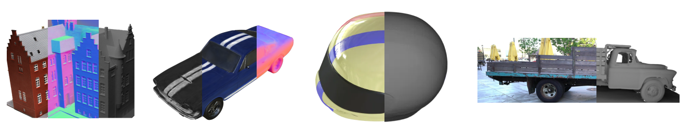

# GS-2M: Material-aware Gaussian Splatting for High-fidelity Mesh Reconstruction
[arXiv](https://arxiv.org/abs/2509.22276) (updating) | [Project Page](https://ndming.github.io/publications/gs2m)


## Installation
The code has been tested on Windows and Linux.

In general, you will need a working C++ compiler to build all CUDA submodules:
- Windows: please make sure your Visual Studio version is `<=17.9.7` (MSVC `<=19.39`), as newer VS versions require CUDA `>=12.4` (older VS BuildTools are available [here](https://learn.microsoft.com/en-us/visualstudio/releases/2022/release-history)). Though it is not guaranteed, more recent combinations of CUDA and VS should work fine.
- Linux: a recent version of GCC is sufficient (we tested with `11.4`)

Clone the repo:
```bash
git clone https://github.com/ndming/GS-2M.git
cd GS-2M
```

Please use `conda`/`mamba` to manage your local environment:
```bash
conda env create --file environment.yml
conda activate gs2m
```

<details>
<summary><span style="font-weight: bold;">Installing with Python virtual environment</span></summary>

Installing with Conda fetches a copy of CUDA toolkit to run locally within the environment. If you instead prefer to use your system-wide CUDA:
- Please make sure your CUDA is visible globally:
```bash
nvcc --version
```
- Create a Python virtual environment and **activate it**:
```bash
python3.10 -m venv gs2m
```
- Install a version of [PyTorch and TorchVision](https://pytorch.org/get-started/previous-versions/) compatible with your CUDA version (you may need to install `numpy<2.0.0` prior to this step becasue `torch` automatically pulls the latest `numpy`).
- Install the remaining packages:
```bash
pip install -r requirements.txt
```

</details>

## Usage
Please follow [3DGS](https://github.com/graphdeco-inria/gaussian-splatting)'s instructions to prepare training data for your own scene.

A COLMAP-prepared training directory for `GS-2M` may look like the following. Note that `masks` is completely optional.
If you have foreground masks of the target object and want to use them, put them as shown below. 
```
scene/
├── images/
│   ├── 001.png
│   ├── 002.png
│   └── ...
├── sparse/
│   └── 0/
│       ├── cameras.bin
│       ├── images.bin
│       └── points3D.bin
├── masks/
│   ├── 001.png
│   ├── 002.png
│   └── ...
└── database.db
```

### Training
```bash
python train.py -s /path/to/scene -m /path/to/model/directory
```

<details>
<summary><span style="font-weight: bold;">Additional settings to change the behavior of train.py</span></summary>

- `--material`: enable material decomposition as part of training, default to `False`.
- `--reflection_threshold`: control how sensitive multi-view photometric variations are to the detection of smooth surfaces.
We suggest setting to `1.0` or greater for diffuse surfaces, and less than `1.0` for reflective surfaces.
- `--lambda_smooth`: if there are not enough reflection clues, increase this parameter to propagate correctly identified roughness.
- `--lambda_normal`: if the reconstructed mesh is not water-tight, increase this parameter to fill the gaps.
- `-r`: downscale input images, recommended for high resolution training data (more than 1k6 pixels width/height).
For example, `-r 2` will train with images at half the resolution of the original.
- `--masks`: the name of the directory containing masks of the foreground object. For the directory structure shown above,
the option shall be specified as `--masks masks`. Note that, by default, the code will pick up the alpha channel of the
GT images for foreground masks if they are RGBA. However, training will prioritize `--masks` over alpha channel if
they co-exist.
- `--mask_gt`: even with `--masks` or the alpha channel from input images, training would still perform with unmasked RGB
as GT. To mask them out and fit Gaussians to the foreground object only, add this option. This is especially useful for
reconstructing objects from scenes with overwhelming background details.

</details>

### Mesh extraction
```bash
python render.py -m /path/to/model/directory --extract_mesh --skip_test
```

The `.ply` file of the extracted triangle mesh should be found under:
```
/path/to/model/directory/train/ours_30000/mesh/tsdf_post.ply
```

<details>
<summary><span style="font-weight: bold;">Important parameters for render.py</span></summary>

- `--max_depth`: the maximum distance beyond which points will be discarded during depth fusion. This can be estimated
from the scene's half extent value reported during training/rendering.
- `--voxel_size`: how dense the sampling grid should be for TSDF fusion.
- `--sdf_trunc`: smaller values yield sharper surfaces but increase sensitivity to depth noise, while larger values
improve robustness to noise but blur fine details.
- `--num_clusters`: how many clusters to keep for mesh post-processing, default to 1 (extract a single object).

</details>

## Evaluation
Please follow these steps to reproduce the evaluation results.

### Mesh reconstruction on the DTU dataset
- Obtain the preprocessed dataset from [2DGS](https://surfsplatting.github.io/), the dataset should be organized as:
```
dtu/
├── scan24/
│   ├── images/
│   ├── sparse/
│   └── ...
├── scan37/
├── scan40/
└── ...
```
- Download the ground truth point clouds from [DTU](https://roboimagedata.compute.dtu.dk/?page_id=36): only the
`SampleSets` and `Points` are required.
- Create a directory named `Official_DTU_Dataset` under `dtu/`, copy `Calibration`, `Cleaned`, `ObsMask`, `Points`,
`Rectified`, `Surfaces` directories from `SampleSets/MVS Data` to `Official_DTU_Dataset/`
- Replace the copied `Official_DTU_Dataset/Points/stl` with `Points/stl`
- Make sure the structure of `Official_DTU_Dataset` is as follows:
```
dtu/Official_DTU_Dataset/
├── Calibration/
├── Cleaned/
├── ObsMask/
├── Points/
├── Rectified/
├── Surfaces/
└── ...
```
- Run the following script:
```bash
# You may need to adjust `data_base_path` in `run_dtu.py` to point to your `dtu/`
python scripts/run_dtu.py
```
- Get reconstruction results for `ours_wo-brdf`:
```shell
python scripts/report_dtu.py --method ours_wo-brdf_30000
```
- Get reconstruction results for `ours`:
```shell
python scripts/report_dtu.py --method ours_30000
```

### Material decomposition on the Shiny Blender Synthetic dataset
- Obtain a copy of the [ShinyBlender](https://dorverbin.github.io/refnerf/) synthetic dataset, organized as:
```
shiny/
├── ball/
│   ├── test/
│   ├── train/
│   ├── transforms_test.json
│   └── transforms_train.json
├── car/
├── coffee/
└── ...
```
- Run the following script:
```bash
# You may need to adjust `data_base_path` in `run_shiny.py` to point to your `shiny/`
python scripts/run_shiny.py
```
- Check the decomposition results under:
```
output/shiny/<scene>/test/ours_30000/visual/
```

### Material decomposition on the Glossy Blender Synthetic dataset
- Obtain a copy of the [GlossyBlender](https://liuyuan-pal.github.io/NeRO/) synthetic dataset, organized as:
```
glossy/
├── angel/
│   ├── 0.png
│   ├── 0-camera.pkl
│   ├── 0-depth.png
│   └── ...
├── bell/
├── cat/
└── ...
```
- Run the following script:
```bash
# You may need to adjust `data_base_path` in `run_glossy.py` to point to your `glossy/`
python scripts/run_glossy.py
```
- Check the reconstruction results under:
```
output/glossy/<scene>/test/ours_10000/
```

### Mesh reconstruction on the TnT dataset
- Obtain a copy of the preprocessed dataset from [GOF](https://huggingface.co/datasets/ZehaoYu/gaussian-opacity-fields/tree/main)
- Visit the [download page](https://www.tanksandtemples.org/download/) of the Tanks and Temples Benchmark for GT
- Download Camera Poses (`*_COLMAP_SfM.log`), Alignment (`*_trans.txt`), Cropfiles (`*.json`), and GT (`*.ply`) for
the Barn and Truck scenes
- Please organize your files as follows:
```
tnt/
├── Barn/
│   ├── sparse/
│   ├── images/
│   ├── Barn_COLMAP_SfM.log
│   ├── Barn.ply
│   ├── Barn.json
│   └── Barn_trans.txt
├── Truck/
└── ...
```
- Run the following script:
```bash
# You may need to adjust `data_base_path` in `run_tnt.py` to point to your `tnt/`
python scripts/run_tnt.py
```
- Check the reconstruction results under:
```
output/tnt/<scene>/train/ours_wo-brdf_30000/mesh/evaluation/
```

## Acknowledgements
This repository and the entire project are based on previous Gaussian splatting works. We acknowledge and appreciate
all the great research and publicly available code that made this possible.
- Baseline and core structure: [3DGS](https://repo-sam.inria.fr/fungraph/3d-gaussian-splatting/)
- High-quality surface reconstruction: [PGSR](https://zju3dv.github.io/pgsr/)
- Improved densification: [AbsGS](https://ty424.github.io/AbsGS.github.io/)
- Material decomposition: [GS-IR](https://lzhnb.github.io/project-pages/gs-ir.html) and [GS-ROR2](https://arxiv.org/abs/2406.18544)
- Depth-normal rendering: [GaussianShader](https://asparagus15.github.io/GaussianShader.github.io/)
- Deferred reflection: [3DGS-DR](https://gapszju.github.io/3DGS-DR/)
- Preprocessed DTU dataset: [2DGS](https://surfsplatting.github.io/)
- Preprocessed TnT dataset: [GOF](https://niujinshuchong.github.io/gaussian-opacity-fields/)
- ShinyBlender synthetic dataset: [Ref-NeRF](https://dorverbin.github.io/refnerf/)
- GlossyBlender synthetic dataset: [NeRO](https://liuyuan-pal.github.io/NeRO/)

## BibTeX
```
@misc{nguyen2025gs2m,
      title={GS-2M: Gaussian Splatting for Joint Mesh Reconstruction and Material Decomposition},
      author={Dinh Minh Nguyen and Malte Avenhaus and Thomas Lindemeier},
      year={2025},
      eprint={2509.22276},
      archivePrefix={arXiv},
      primaryClass={cs.CV},
      url={https://arxiv.org/abs/2509.22276},
}
```
